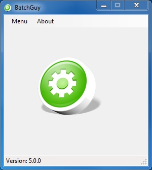

<h1>What is BatchGuy?</h1>
One of my hobbies is to collect full Blu-ray discs and to either remux or encode them.  I am a huge fan of TV Shows, so I typically work with multiple discs that contain tv series that can have over 30 episodes.

The problem that I faced is that most of the GUI tools available do not allow you to work with Blu-rays from a batch point of view.  This is fine for movies but having to manually work with each stream on each disc for each episode is very tiresome.  Because of this, I decided to make my own quick and dirty tool to ease some of the pain. 

<h1>What BatchGuy isn’t?</h1>
BatchGuy was created to do a specific job, which is to allow the user to be able to easily extract streams from multiple ripped Blu-ray dics, place them in an individual episode number directory, create N number of AviSynth scripts per episode and apply global x264 encode settings for each episode.  

BatchGuy is not an AviSynth editor.  It has very limited AviSynth syntax capabilities (which could be expanded as the product evolves).  It allows you to copy/paste AviSynth syntax into it and it will create a (.avs) file for each video you extracted from your Blu-ray discs.

BatchGuy is not an x264 encoder.  BatchGuy will create a (.bat) file thatyou can use to run the x264.exe encodder.  BatchGuy will not extract streams from Blu-ray discs for you.  BatchGuy will allow you to pick which streams you would like to extract and will create a (.bat) file that will use eac3to.exe that will extract the streams.

<h1>Overview</h1>
BatchGuy, in a nutshell allows you to choose ripped Blu-ray dics on your hard drive, pick the chapters, video, audio and subtitles, specify what episode number they are and will create a batch file (.bat) called <i>"batchguy.extract.bluray.bat"</i> that you can run to extract all the streams.  The streams will be placed in directory your choosinge plus the episode number you gave it ie e01, e02 etc etc.

After you have extracted all of your files, BatchGuy will allow you create AviSynth Script files (.avs) for all of your extracted video streams (.mkv).  You just tell BatchGuy where you would like to output the scripts, specify some limited Avisynth syntax for each video ie cropping, resizing etc etc and how many many video streams (.mkv) you have.  BatchGuy will then create an AviSynth Script file for each video stream ie encode01.avs, encode02.avs and each script file will have the same AviSynth syntax.  BatchGuy is limited to FFVideoSource and the video stream (.mkv) location for FFVideoSource will be set to <i>“output_directory_selected\e01\encode01.mkv”</i>.

Next, BatchGuy will allow you to choose the directory where the AviSynth scripts reside (.avs) and allow you to load them into the GUI.  The user can then associate each AviSynth Script with a title the user enters.  After this, the user can specify x264 settings to apply to all video streams (.mkv) and create a batch file (.bat) called <i>"batchguy.encode.bluray.bat"</i> that the user can run to encode all extracted videos (.mkv), using the AviSynth scripts created (.avs) and the x264 settings specified.

<h1>The Application</h1>
<b>Create Eac3to Batch File Screen: </b> Using eac3to.exe, this screen is used to load ripped Blu-ray disc(s) information and allows the user to pick which Blu-ray summary items they want to rip.  After all relevant information is chosen on this screen and the Blu-ray Title Info Screen, this screen will output a (.bat) file that will have the eac3to arguments to extract all the streams chosen.  It will place each "episode" in its own folder, denoted as exx ie e01, e02, etc etc.  Video files will be denoted as encodexx.mkv, chapters will be chapterxx.txt, subtitles will be the languagexx.sup and audio will be languagexx and the correct audio extension ie english01.ac3.

<b>Blu-ray Title Info Screen: </b> When the user double-clicks on an item in the Disc Summary Grid on the Create Eac3to Batch File Screen, the user will be presented with this screen.  This screen allows the user to select video, audio, subtitle and chapter information they would like to extract.

<b>Create AviSynth Files Screen: </b> This screen will allow the user to apply global AviSynth settings to each episode.  It has very limited AviSynth scripting and FFVideoSource is the default video filter.  The user will specify the location that the (.avs) files will be created, the number of files (episodes) and can enter AviSyth scripting.  Each (.avs) file will point the FFVideoSource video location as the "output_directory_chosen\exx\encodexx.mkv".

<h1>Screenshots:</h1>

  

  

  

  

<h1>Requirements:</h1>
Windows 7 x64  
.Net Framework 4.5+ 
eac3to 
vfw4x264 
AviSynth 2.5+ 
