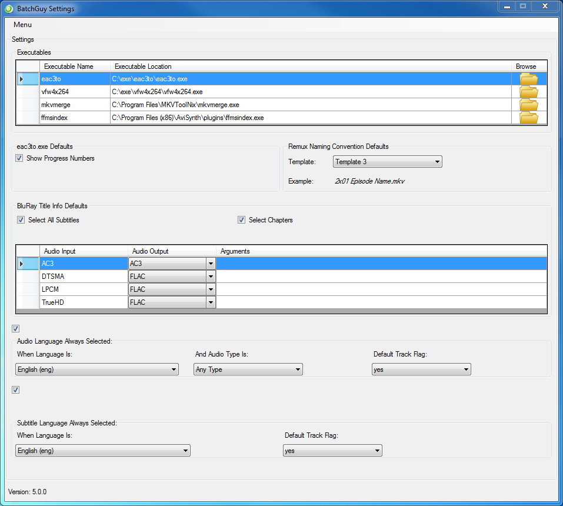
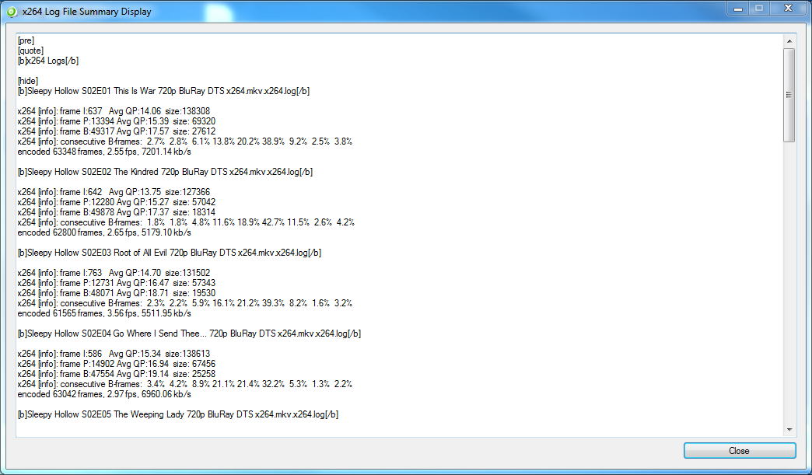

<h1>What is BatchGuy?</h1>
One of my hobbies is to collect full Blu-ray discs and to either remux or encode them.  I am a huge fan of TV Shows, so I typically work with multiple discs that contain tv series that can have over 30 episodes.

The problem that I faced is that most of the GUI tools available do not allow you to work with Blu-rays from a batch point of view.  This is fine for movies but having to manually work with each stream on each disc for each episode is very tiresome.  Because of this, I decided to make my own tool to ease some of the pain. 

As I continued to make modifications to BatchGuy, I started to think that this tool could possibly be helpful to other Blu-ray encoders such as myself, so I decided to share this tool with the community.

<h1>What BatchGuy isn’t?</h1>
BatchGuy was created to do a specific job, which is to allow the user to be able to easily extract streams from multiple ripped Blu-ray dics, place them in an individual episode number directory, create AviSynth scripts per episode and apply global x264 encode settings for each episode.  

BatchGuy is not an AviSynth editor.  It has very limited AviSynth syntax capabilities (which could be expanded as the product evolves).  It allows you to copy/paste AviSynth syntax into it and it will create a (.avs) file for each video you extracted from your Blu-ray discs.

BatchGuy is not an x264 encoder.  BatchGuy will create a (.bat) file that you can use to run the x264.exe encoder.  BatchGuy will not extract streams from Blu-ray discs for you.  BatchGuy will allow you to pick which streams you would like to extract and will create a (.bat) file that will use eac3to.exe to extract the streams.

<h1>Screenshots:</h1>

  

  

  

  

  

  

  

<h1>Installation</h1>
Unzip the BatchGuy folder to any location of your choosing.  With the introduction of BatchGuy Version 1.2, the user can save settings, so it is best to keep the BatchGuy.exe in the BatchGuy folder, which is where the settings file <i>(config.batchGuySettings)</i> will be saved.  However, a shortcut to the BatchGuy.exe can be placed anywhere.

<h1>Requirements:</h1>
<ul>
<li>Windows 7, 8.1 x64 </li>
<li>.Net Framework 4.5+</li>
<li>eac3to</li>
<li>vfw4x264</li>
<li>AviSynth 2.5+ and all relevant plugins</li>
</ul>
